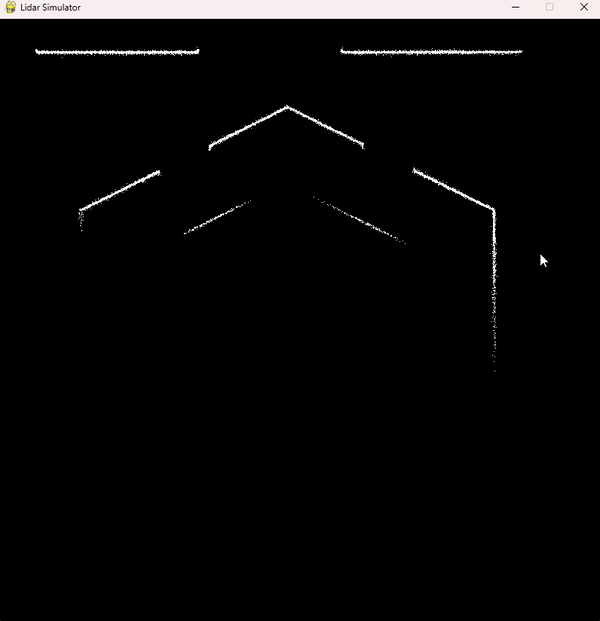
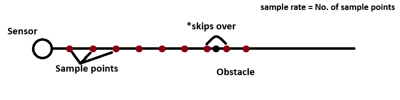

# Simulate-LIDAR-Sensor-SLAM-system-with-Pygame

## Introduction

Welcome to my project where I've simulate a lidar sensor with pygame. This project is a personal effort to gain knowledge of working with LIDAR sensor data. Mouse cursor is used as the simulated LIDAR sensor and the architecutre of the sensor is explained below.

* RUN `python run_lidar.py` to simulate ONLY the sensor.
* RUN `python run_dbscan.py` to simulate the sensor and feature extraction.

### Workflow

## Sensor Implementation

The sensor has a few properties.
* Range
* Sample Rate
* Angle Rate

 The LIDAR sensor constantly rotates and collects information about its surroundings. My sensor imitates this behavior using `numpy.linspace` over the range `[0, 2π]`. The angle rate determines how many samples from one complete rotation should be used to detect data points.

### Point Detection

To simulate real-world point detection, the sensor does not penetrate through objects. This has been implemented using linear interpolation.

1. For each angle, a line segment of length equal to the sensor's range is generated.
1. The line is uniformly sampled (equidistant points are generated).
1. The sensor iterates through these sample points, starting from the one closest to the sensor.
1. Each point is checked for the presence of an obstacle (black pixel). If an obstacle is detected, that point is stored as a detected point.

The detected points are visualized as white pixels.

However, there is an issue with this method. It can skip over the obstacle.

## Map

For simplicity, the map has a white background and black walls (obstacles). The sensor detects the black pixels. You can modify the map as needed.
Refer to `assests_readme/map3.png`.

## Feature Extraction

Once the data points are detected, the [DBSCAN](https://scikit-learn.org/dev/modules/generated/sklearn.cluster.DBSCAN.html) algorithm is used to cluster them. Each cluster is assigned a random color.

To test feature extraction:
  1. Run python run_dbscan.py.
  1. Move the cursor around the map to collect data points.
  1. Press the spacebar to apply DBSCAN and visualize the clusters.
  1. Continue collecting more data points and repeat as needed.

## NOTE

There are so many mathematical functions on the utlis.py file. I'm also implementing another feature extraction algorithm called [Seeded Region Growing](https://journals.sagepub.com/doi/pdf/10.1177/1729881418755245) by `Haiming Gao`. This project will be updated in near future. Feel free to contact me for any issues, question and etc.

Inspiration : [Mouad Boumediene - Hobby Coding](https://www.youtube.com/@hobby_coding)
